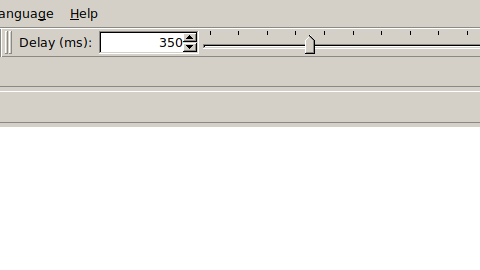
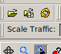

# Create a Network from Scratch Using netconvert
netconvert is a command-line tool in SUMO that generates the .net.xml file (SUMO network) from a description of the road layout.

## Basic Steps:
1. Create a Node File (nodes.nod.xml)
This defines junctions (intersections or endpoints).

```xml
<nodes>
  <node id="n1" x="0.0" y="0.0" type="priority"/>
  <node id="n2" x="100.0" y="0.0" type="priority"/>
  <node id="n3" x="100.0" y="50.0" type="priority"/>
</nodes>
```

2. Create an Edge File (edges.edg.xml)
This defines roads connecting nodes.

```xml
<edges>
  <edge id="e1" from="n1" to="n2" numLanes="1" speed="13.9"/>
  <edge id="e2" from="n2" to="n3" numLanes="2" speed="13.9"/>
</edges>
```

3. Generate the Network
Run:
```bash
netconvert -n nodes.nod.xml -e edges.edg.xml -o basic_net.net.xml
```
This creates basic_net.net.xml — the SUMO network file.

## Visualise the Network Using sumo-gui
After generating the network, you can open it visually:

1. Open SUMO GUI
```bash
sumo-gui
```

2. Load the Network
   - Go to File → Open Network
   - Select your file basic_net.net.xml
   - You should see your network with nodes and edges.

## Add Routes and Simulate Traffic
Create a Route File (basic_routes.rou.xml)

```xml
<routes>
  <vType id="car" accel="2.0" decel="4.5" length="5" maxSpeed="13.9" color="1,0,0"/>

  <route id="r1" edges="e1"/>
  <route id="r2" edges="e2"/>
  
  <vehicle id="veh1" type="car" route="r2" depart="1"/>
  <vehicle id="veh2" type="car" route="r1" depart="1"/>

  <trip id="veh3" type="car" depart="0.50" departLane="best" departPos="random" departSpeed="max" from="e1" to="e2"/>
  <trip id="veh4" depart="1.00" departLane="best" departPos="random" departSpeed="max" from="e1" to="e2"/>
</routes>
```

Run a Simulation in GUI

```bash
sumo-gui -n basic_net.net.xml -r basic_routes.rou.xml
```

You can now observe vehicles moving along the defined roads.

## Adjusting Simulation Speed

If the simulation runs too quickly to observe conveniently:

1. Adjust the delay value in the simulation controls:




2. Remember to click on the "reload" button before running the simulation:


